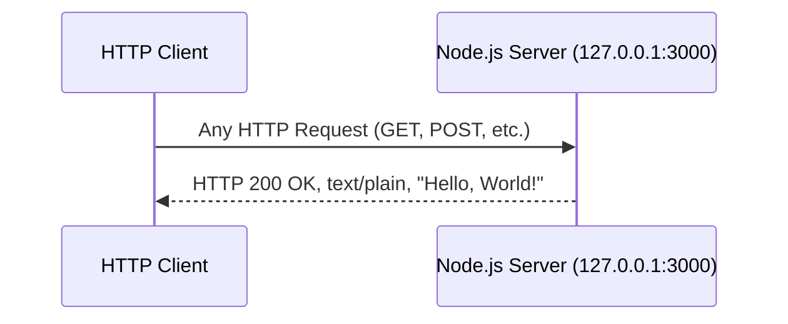

# Hello World Node.js Server

## Overview

A minimal "Hello World" HTTP server built with the Node.js built-in `http` module. This project (`hao-backprop-test`) serves as a test and demo project for Backprop integration.

**Key characteristics:**

- **Technology:** Node.js with CommonJS module system
- **Dependencies:** Zero external npm packages — uses only the Node.js core `http` module
- **Design:** Intentionally minimal — no frameworks, no routing, no middleware
- **Package name:** `hello_world`
- **Version:** `1.0.0`

## Prerequisites

- **Node.js v18 or later** — required based on `lockfileVersion: 3` in `package-lock.json`, which corresponds to npm v7+/v9+ shipping with Node.js v18+
- **npm v7+** — ships automatically with Node.js v18+
- No other tools, services, or dependencies are required

## Installation

1. Clone the repository:

```bash
git clone <repository-url>
```

2. Navigate to the project directory:

```bash
cd hao-backprop-test
```

3. Install dependencies (optional — this project has zero external dependencies, but this step is good practice for reproducibility):

```bash
npm install
```

## Usage

### Starting the Server

Run the server with Node.js:

```bash
node server.js
```

Expected output:

```
Server running at http://127.0.0.1:3000/
```

> **⚠️ Entry Point Discrepancy:** The `package.json` file declares `"main": "index.js"`, but the actual server file is `server.js`. You must run `node server.js` explicitly — running `node .` or relying on the `main` field will not start the server.

### Verifying the Server

Use `curl` to send a request to the server:

```bash
curl http://127.0.0.1:3000/
```

Expected output:

```
Hello, World!
```

Alternatively, open [http://127.0.0.1:3000/](http://127.0.0.1:3000/) in a web browser to see the response.

## API Documentation

### Endpoint Overview

| Method | Path | Status | Content-Type | Response Body |
|---|---|---|---|---|
| Any (GET, POST, PUT, DELETE, etc.) | Any path (`/`, `/foo`, `/bar/baz`) | 200 OK | `text/plain` | `Hello, World!\n` |

### Request

- The server accepts **any HTTP method** (GET, POST, PUT, DELETE, PATCH, OPTIONS, HEAD, etc.)
- The server accepts **any URL path** (`/`, `/foo`, `/bar/baz`, etc.)
- No request headers are required
- No request body is processed
- The request object (`req`) is completely ignored by the handler

### Response

- **Status Code:** `200 OK` (always, regardless of request)
- **Headers:** `Content-Type: text/plain`
- **Body:** `Hello, World!\n` (with trailing newline character)
- The response is **identical** regardless of request method, path, headers, or body

## Request-Response Flow

The following diagram illustrates the server's request-response cycle. The server responds identically to every request, regardless of HTTP method or path.



## Deployment Guide

### Local Deployment

Start the server with direct Node.js execution:

```bash
node server.js
```

- The server binds to `127.0.0.1` (localhost only) — it is **not accessible** from external networks by default
- To stop the server, press `Ctrl+C` in the terminal

### Production Considerations

This server is a minimal demo and has the following **limitations**:

- **No routing** — all paths return the same response
- **No error handling** — unhandled exceptions will crash the server
- **No HTTPS support** — plaintext HTTP only
- **No graceful shutdown** — no `SIGTERM`/`SIGINT` signal handlers are registered
- **Localhost-only binding** — not accessible from external networks unless the hostname is changed
- **No request logging** — requests are not logged beyond the initial startup message
- **No environment variable support** — hostname and port are hardcoded constants in `server.js`

### Environment Configuration

The server's hostname and port are defined as constants in `server.js`:

- To change the **hostname**: modify the `hostname` constant in `server.js` (line 3)
- To change the **port**: modify the `port` constant in `server.js` (line 4)
- To bind to **all network interfaces** (making the server externally accessible): change `hostname` to `'0.0.0.0'`

> **Note:** These values are hardcoded constants. Environment variable support (e.g., `process.env.PORT`) would need to be added for production use.

## Project Structure

This repository has a flat structure with 13 files at the root level and no subdirectories:

| File | Description |
|---|---|
| `server.js` | Main HTTP server — entry point for running the application |
| `server - Copy.js` | Exact duplicate of `server.js` (test baseline artifact) |
| `package.json` | Node.js project metadata and configuration |
| `package-lock.json` | Dependency lock file (records zero external dependencies) |
| `README.md` | Project documentation (this file) |
| `LoginTest.java` | Placeholder Java test class (non-functional) |
| `LoginTest - Copy.java` | Exact duplicate of `LoginTest.java` (test baseline artifact) |
| `industry.csv` | Static CSV vocabulary data (44 industry categories) |
| `industry - Copy.csv` | Exact duplicate of `industry.csv` (test baseline artifact) |
| `test.py.txt` | Empty sentinel file (test baseline artifact) |
| `test.py - Copy.txt` | Empty sentinel file (test baseline artifact) |
| `test.blitzyignore.txt` | Empty sentinel file (test baseline artifact) |
| `test1.blitzyignore.txt` | Empty sentinel file (test baseline artifact) |

> **Note:** The duplicate files (suffixed with ` - Copy`) and empty sentinel files are intentional test baseline artifacts. The flat repository structure with multi-language placeholder files is part of the project's design for integration testing.

## Technical Details

- **Runtime:** Node.js (v18+ recommended, based on `lockfileVersion: 3` in `package-lock.json`)
- **Module system:** CommonJS (`require()`)
- **Dependencies:** Zero external npm packages
- **Built-in modules used:** `http` (Node.js core)
- **Entry point discrepancy:** `package.json` declares `"main": "index.js"` but the actual server file is `server.js` — use `node server.js` to start the server

## License

MIT License — as declared in `package.json`.

## Author

**hxu** — as declared in `package.json`.
