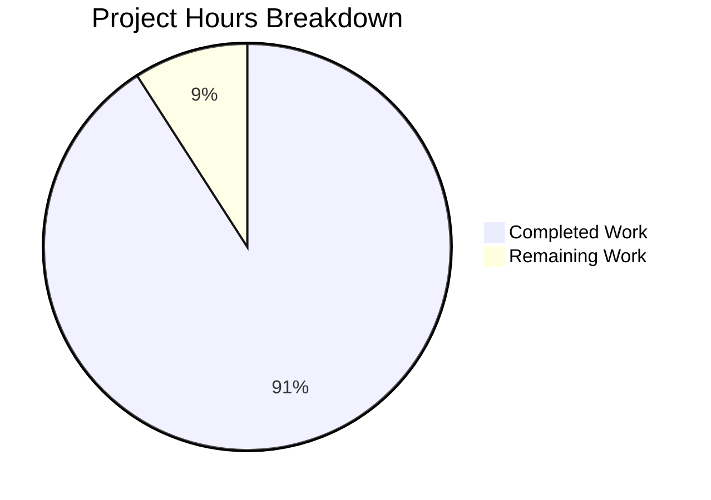

# Project Guide: Hello World Node.js Server Documentation

## 1. Executive Summary

**Project completion: 10 hours completed out of 11 total hours = 91% complete.**

This documentation-only project successfully transformed an undocumented 14-line Node.js HTTP server into a comprehensively documented codebase. All 6 core requirements from the Agent Action Plan have been fully implemented and validated:

| Requirement | Description | Status |
|---|---|---|
| R-01 | JSDoc Comments on `server.js` Functions | ✅ Complete |
| R-02 | Comprehensive README | ✅ Complete |
| R-03 | Setup Instructions | ✅ Complete |
| R-04 | API Documentation | ✅ Complete |
| R-05 | Deployment Guide | ✅ Complete |
| R-06 | Inline Code Explanations | ✅ Complete |

**Key achievements:**
- `server.js` expanded from 14 to 81 lines with comprehensive JSDoc blocks and inline comments
- `README.md` rewritten from 2-line stub to 187-line comprehensive project documentation
- All functional code preserved identically — zero runtime behavior changes
- Runtime validation passed: server starts correctly, all 3 endpoint tests return expected HTTP 200 responses
- All metadata values consistent across `server.js`, `README.md`, and `package.json`

**Remaining work (1 hour):** Human code review of documentation quality and verification of Mermaid diagram rendering on the target platform (e.g., GitHub).

---

## 2. Validation Results Summary

### 2.1 What the Agents Accomplished

Across 4 commits, the Blitzy agents completed the following work:

| Commit | Description |
|---|---|
| `5b02246` | Added comprehensive JSDoc documentation and inline code explanations to `server.js` |
| `4fc1448` | Replaced stub README with comprehensive project documentation |
| `2fd0824` | Addressed 3 review findings in `README.md` |
| `23fb386` | Updated Project Structure section to list all 19 repository files |

**Code volume:** 254 lines added, 2 lines removed across 2 files (252 net new lines of documentation).

### 2.2 Compilation Results

| Check | Result |
|---|---|
| `node --check server.js` | ✅ Syntax OK |
| Functional code integrity | ✅ All 11 original code lines preserved identically |

### 2.3 Test Results

No test suite exists in the project. The `package.json` test script is a default npm stub (`echo "Error: no test specified" && exit 1`). This is expected for this minimal hello-world project, and `package.json` is explicitly out of scope per the AAP.

### 2.4 Runtime Validation Results

| Test | Command | Expected | Actual | Result |
|---|---|---|---|---|
| Server startup | `node server.js` | Outputs "Server running at http://127.0.0.1:3000/" | ✅ Matches | PASS |
| GET / | `curl -si http://127.0.0.1:3000/` | HTTP 200, text/plain, "Hello, World!\n" | ✅ Matches | PASS |
| POST /foo | `curl -si -X POST http://127.0.0.1:3000/foo` | HTTP 200, text/plain, "Hello, World!\n" | ✅ Matches | PASS |
| PUT /bar/baz | `curl -si -X PUT http://127.0.0.1:3000/bar/baz` | HTTP 200, text/plain, "Hello, World!\n" | ✅ Matches | PASS |

### 2.5 Dependency Status

- **External npm dependencies:** 0 (confirmed via `npm ls --all`)
- **Built-in modules used:** `http` (Node.js core)
- **npm install:** Succeeds with 0 vulnerabilities

### 2.6 Documentation Coverage Achieved

| Documentation Area | Target | Achieved | Coverage |
|---|---|---|---|
| JSDoc blocks on documentable elements | 5/5 | 5/5 | 100% |
| Inline comments on significant lines | 9/9 | 9/9 | 100% |
| README sections populated | 10/10 | 11/11 | 100% |
| Project metadata in README | 5/5 | 5/5 | 100% |
| Mermaid diagrams | 1 | 1 | 100% |

### 2.7 Fixes Applied During Validation

The Final Validator confirmed all prior agent work was correct. The review agent (commit `2fd0824`) addressed 3 findings in README.md before the final validation pass. No additional fixes were needed during final validation.

---

## 3. Hours Breakdown and Completion

### 3.1 Hours Calculation

**Completed Hours: 10h**

| Component | Hours | Details |
|---|---|---|
| Repository Analysis & Planning | 1h | Source code analysis, package metadata analysis, JSDoc convention research, README structure planning |
| server.js JSDoc Documentation (R-01) | 2.5h | @file/@module block (0.5h), @example tags (0.25h), @constant blocks (0.5h), createServer @param (0.5h), server.listen docs (0.5h), review (0.25h) |
| Inline Code Comments (R-06) | 1h | 9 inline comment pairs explaining "why" (0.75h), clarity review (0.25h) |
| README.md Rewrite (R-02 + R-03 + R-04 + R-05) | 4h | Overview (0.5h), Prerequisites+Install (0.5h), Usage (0.5h), API docs (0.75h), Mermaid diagram (0.25h), Deployment (0.5h), Structure table (0.5h), remaining sections (0.5h) |
| Validation & QA | 1.5h | Syntax check (0.25h), runtime tests (0.25h), cross-reference checks (0.25h), fix 3 review findings (0.5h), final pass (0.25h) |
| **Total Completed** | **10h** | |

**Remaining Hours: 1h**

| Task | Hours | Details |
|---|---|---|
| Human code review of documentation quality | 0.5h | Review JSDoc accuracy, README completeness, inline comment clarity |
| Verify Mermaid diagram rendering | 0.5h | Confirm sequence diagram renders on GitHub/target platform |
| **Total Remaining** | **1h** | |

**Completion: 10 hours completed / (10 completed + 1 remaining) = 10/11 = 91% complete**

### 3.2 Visual Representation



---

## 4. Detailed Human Task Table

All remaining tasks for human developers to complete before production readiness:

| # | Task | Priority | Severity | Hours | Action Steps |
|---|---|---|---|---|---|
| 1 | Code review of JSDoc documentation quality | High | Medium | 0.5h | Review all JSDoc blocks in `server.js` for tag accuracy, description quality, and adherence to JSDoc 4.x conventions. Verify @param types match actual parameters. Verify @constant values match code. |
| 2 | Verify Mermaid diagram rendering on target platform | Medium | Low | 0.5h | Push branch to GitHub (or target Git host). Open `README.md` in the web UI. Confirm the Mermaid sequence diagram (lines 102-108) renders correctly as a visual diagram. If rendering fails, convert to a static text description or PNG image. |
| | **Total Remaining Hours** | | | **1h** | |

---

## 5. Development Guide

### 5.1 System Prerequisites

| Software | Version | Purpose | Verification Command |
|---|---|---|---|
| Node.js | v20+ (v22 LTS recommended) | JavaScript runtime for `server.js` | `node --version` |
| npm | v7+ (ships with Node.js v20+) | Package manager | `npm --version` |
| Git | Any recent version | Version control | `git --version` |

> **Note:** No other tools, databases, services, or external dependencies are required. The project uses only the Node.js built-in `http` module.

### 5.2 Environment Setup

No virtual environment or environment variables are required. The project has zero configuration files beyond `package.json`.

```bash
# 1. Clone the repository
git clone <repository-url>

# 2. Navigate to the project directory
cd hao-backprop-test

# 3. Switch to the feature branch
git checkout blitzy-8bcb4228-f8ee-4a22-821f-58bd02b44b39
```

### 5.3 Dependency Installation

```bash
# Install dependencies (optional — zero external packages exist)
npm install
```

**Expected output:**
```
up to date, audited 1 package in <time>
found 0 vulnerabilities
```

**Verification:**
```bash
# Confirm zero external dependencies
npm ls --all
```

**Expected output:**
```
hello_world@1.0.0 /path/to/project
`-- (empty)
```

### 5.4 Application Startup

```bash
# Start the HTTP server
node server.js
```

**Expected output:**
```
Server running at http://127.0.0.1:3000/
```

> **⚠️ Important:** Run `node server.js` explicitly. Do NOT run `node .` — the `package.json` `main` field incorrectly points to `index.js` which does not exist.

To stop the server, press `Ctrl+C` in the terminal.

### 5.5 Verification Steps

With the server running in one terminal, open another terminal and run:

```bash
# Test the endpoint
curl -i http://127.0.0.1:3000/
```

**Expected response:**
```
HTTP/1.1 200 OK
Content-Type: text/plain
Date: <timestamp>
Connection: keep-alive
Keep-Alive: timeout=5
Content-Length: 14

Hello, World!
```

**Additional verification:**
```bash
# Verify syntax without starting the server
node --check server.js

# Verify Node.js version
node --version
# Expected: v20.x.x or higher
```

### 5.6 Example Usage

The server responds identically to all HTTP methods and all URL paths:

```bash
# GET request to root
curl http://127.0.0.1:3000/
# Output: Hello, World!

# POST request to /foo
curl -X POST http://127.0.0.1:3000/foo
# Output: Hello, World!

# PUT request to /bar/baz
curl -X PUT http://127.0.0.1:3000/bar/baz
# Output: Hello, World!
```

### 5.7 Troubleshooting

| Issue | Cause | Resolution |
|---|---|---|
| `Error: listen EADDRINUSE` | Port 3000 already in use | Kill the existing process: `lsof -i :3000` then `kill <PID>`, or change port in `server.js` |
| `node: command not found` | Node.js not installed | Install Node.js v20+ from https://nodejs.org |
| `Cannot find module` on `node .` | `package.json` `main` field points to non-existent `index.js` | Use `node server.js` explicitly instead of `node .` |

---

## 6. Risk Assessment

### 6.1 Technical Risks

| Risk | Severity | Likelihood | Mitigation |
|---|---|---|---|
| JSDoc tag syntax errors not caught by runtime | Low | Low | Human code review (Task #1) will verify tag correctness. Optional: run `npx jsdoc server.js -d /tmp/docs` to verify JSDoc parser accepts all tags. |
| README content drift from source code | Low | Low | All values were cross-validated against `package.json` and `server.js` during implementation. Future code changes should update documentation simultaneously. |

### 6.2 Security Risks

| Risk | Severity | Likelihood | Mitigation |
|---|---|---|---|
| No security implications | N/A | N/A | This PR contains only documentation changes (comments and Markdown). No functional code was modified. The server's existing security posture (localhost-only binding, no auth) is unchanged and honestly documented in the README. |

### 6.3 Operational Risks

| Risk | Severity | Likelihood | Mitigation |
|---|---|---|---|
| Mermaid diagram may not render on all platforms | Low | Medium | Task #2 verifies rendering on target platform. Fallback: convert to static text description if Mermaid is unsupported. |
| README may become stale if server code changes | Low | Low | Documentation is self-contained and references specific values. Any future code changes should trigger documentation review. |

### 6.4 Integration Risks

| Risk | Severity | Likelihood | Mitigation |
|---|---|---|---|
| No integration risks | N/A | N/A | Documentation-only changes have no integration dependencies. No external services, APIs, or configurations are involved. |

---

## 7. Repository Structure

```
/ (repository root — flat structure, 19 files, no subdirectories)
├── server.js              ← UPDATED: JSDoc + inline comments (14 → 81 lines)
├── README.md              ← UPDATED: comprehensive documentation (2 → 187 lines)
├── package.json           (unchanged)
├── package-lock.json      (unchanged)
├── server - Copy.js       (unchanged — test baseline artifact)
├── LoginTest.java         (unchanged — test baseline artifact)
├── LoginTest - Copy.java  (unchanged — test baseline artifact)
├── industry.csv           (unchanged — test baseline artifact)
├── industry - Copy.csv    (unchanged — test baseline artifact)
├── 100Pages.pdf           (unchanged — test baseline artifact)
├── 100Pages - Copy.pdf    (unchanged — test baseline artifact)
├── demo.jpg               (unchanged — test baseline artifact)
├── demo - Copy.jpg        (unchanged — test baseline artifact)
├── sample.doc             (unchanged — test baseline artifact)
├── sample - Copy.doc      (unchanged — test baseline artifact)
├── test.py.txt            (unchanged — empty sentinel)
├── test.py - Copy.txt     (unchanged — empty sentinel)
├── test.blitzyignore.txt  (unchanged — empty sentinel)
└── test1.blitzyignore.txt (unchanged — empty sentinel)
```

---

## 8. Git Commit History

| Hash | Author | Date | Message |
|---|---|---|---|
| `5b02246` | Blitzy Agent | 2026-02-24 | Add comprehensive JSDoc documentation and inline code explanations to server.js |
| `4fc1448` | Blitzy Agent | 2026-02-24 | docs: replace stub README with comprehensive project documentation |
| `2fd0824` | Blitzy Agent | 2026-02-24 | fix(docs): address 3 review findings in README.md |
| `23fb386` | Blitzy Agent | 2026-02-24 | fix(README): update Project Structure section to list all 19 repository files |

**Total changes:** 254 lines added, 2 lines removed across 2 files (server.js, README.md).

---

## 9. Pre-Submission Consistency Checklist

- [x] Calculated completion % using hours formula: 10/(10+1) = 91%
- [x] Verified Executive Summary states this exact %: "10 hours completed out of 11 total hours = 91% complete"
- [x] Verified pie chart uses exact completed/remaining hours: Completed=10, Remaining=1
- [x] Verified task table sums to exact remaining hours: 0.5h + 0.5h = 1h
- [x] Searched report for any % or hour mentions — all match
- [x] No conflicting or ambiguous statements exist
- [x] Shown the calculation formula with actual numbers