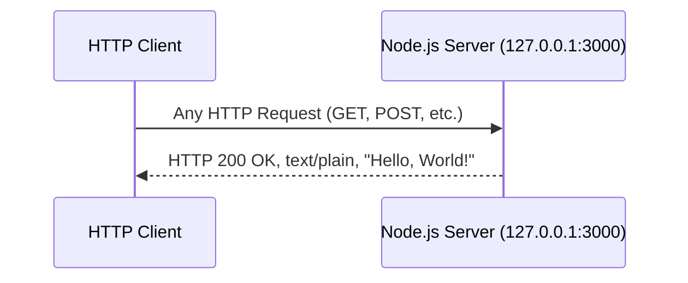

# Technical Specification

# 0. Agent Action Plan

## 0.1 Intent Clarification

### 0.1.1 Core Documentation Objective

Based on the provided requirements, the Blitzy platform understands that the documentation objective is to **transform an undocumented, minimal Node.js HTTP server project into a comprehensively documented codebase** through two parallel workstreams: (1) adding structured JSDoc comments and inline code explanations directly within the `server.js` source file, and (2) replacing the current stub `README.md` with a full-featured project README containing setup instructions, API documentation, and a deployment guide.

- **Documentation Category:** Create new documentation and update existing documentation
- **Documentation Types:** Inline code documentation (JSDoc), project README, API reference, deployment guide, setup instructions

**Requirement Breakdown with Enhanced Clarity:**

- **R-01: JSDoc Comments on `server.js` Functions** — Add JSDoc block comments to every documentable element in `server.js`, including the file-level overview (`@file`), module constants (`@constant`), the HTTP request handler callback (`@param`, `@callback`), and the server listener. Each JSDoc block must include descriptions, type annotations, and parameter/return documentation following the JSDoc 4.x standard syntax.
- **R-02: Comprehensive README** — Replace the existing 2-line `README.md` (currently containing only `# hao-backprop-test` and `test project for backprop integration. Do not touch!`) with a professionally structured README that serves as the primary entry point for project understanding.
- **R-03: Setup Instructions** — Document the prerequisites (Node.js runtime), installation steps, and commands required to get the server running locally.
- **R-04: API Documentation** — Document the HTTP server's single endpoint behavior: accepted methods, request/response format, status codes, headers, and response body.
- **R-05: Deployment Guide** — Provide instructions for deploying the HTTP server beyond local development, including environment considerations and production readiness notes.
- **R-06: Inline Code Explanations** — Add explanatory inline comments (`//`) throughout `server.js` that clarify the purpose and behavior of each code block for developers unfamiliar with Node.js HTTP fundamentals.

### 0.1.2 Special Instructions and Constraints

- The existing `README.md` governance directive ("test project for backprop integration. Do not touch!") applies to the test baseline stability, not to documentation improvements. Documentation enhancements are explicitly requested by the user and therefore override the static-baseline intent for these specific files.
- No user-provided templates were supplied; documentation structure will follow Node.js community conventions.
- No Figma designs or UI components are involved in this documentation task.
- No design system is applicable to this documentation-only task.
- The project has **zero external npm dependencies** — documentation must reflect this minimal footprint.
- The `package.json` entry point mismatch (`main: "index.js"` vs. actual entry `server.js`) should be noted in the README documentation.

### 0.1.3 Technical Interpretation

These documentation requirements translate to the following technical documentation strategy:

- To **document server.js functions with JSDoc**, we will UPDATE `server.js` by inserting `/** ... */` JSDoc comment blocks above every constant declaration, the `http.createServer` callback, and the `server.listen` invocation, using standard JSDoc tags (`@file`, `@module`, `@constant`, `@param`, `@callback`, `@description`, `@type`, `@example`).
- To **create a comprehensive README**, we will UPDATE `README.md` by replacing its current 2-line content with a multi-section Markdown document covering project overview, prerequisites, installation, usage, API reference, deployment, project structure, and license information.
- To **add inline code explanations**, we will UPDATE `server.js` by inserting single-line `//` comments alongside key code statements that explain the "why" behind each operation (e.g., why `127.0.0.1` is used, what `res.end()` does, why `text/plain` is the content type).

### 0.1.4 Inferred Documentation Needs

Based on repository analysis, the following implicit documentation needs have been identified:

- **Project structure explanation** — The flat 13-file repository with duplicate files (`- Copy` variants), empty sentinels, and multi-language placeholders requires explanation so readers understand the intentional test-baseline design.
- **Entry point clarification** — The `package.json` declares `main: "index.js"` but the actual server is `server.js`; documentation must clarify this discrepancy.
- **Technology context** — The server uses Node.js core `http` module with CommonJS `require()` syntax; documentation should note this is intentional (zero-dependency design) rather than an oversight.
- **Limitations and non-features** — The server has no routing, no error handling, no graceful shutdown, and no HTTPS support; the README should set accurate expectations.
- **License visibility** — The MIT license declared in `package.json` should be prominently documented in the README.

## 0.2 Documentation Discovery and Analysis

### 0.2.1 Existing Documentation Infrastructure Assessment

Repository analysis reveals a **near-absent documentation infrastructure** with only a minimal stub README and zero documentation tooling configured. The entire repository is a flat directory with 13 files at root level and no subdirectories.

**Documentation file search results:**

| Pattern Searched | Files Found | Status |
|---|---|---|
| `README*` | `README.md` (73 bytes) | Stub — contains only heading and governance note |
| `docs/**` | None | No documentation directory exists |
| `*.md` (non-README) | None | No additional Markdown files |
| `*.mdx`, `*.rst` | None | No alternative documentation formats |
| `wiki/**` | None | No wiki directory |
| `CONTRIBUTING.md` | None | Not present |
| `CHANGELOG.md` | None | Not present |
| `LICENSE` | None | License declared in `package.json` but no standalone file |

**Current `README.md` contents (complete):**
```
# hao-backprop-test

test project for backprop integration. Do not touch!
```

**Documentation infrastructure findings:**

- **Current documentation framework:** None — no documentation generator is configured
- **Documentation generator configuration:** Not present — no `mkdocs.yml`, `docusaurus.config.js`, `sphinx.conf.py`, `jsdoc.json`, or `.readthedocs.yml` exists in the repository
- **API documentation tools in use:** None — no JSDoc, Swagger, or OpenAPI configuration detected
- **Diagram tools detected:** None — no Mermaid, PlantUML, or diagram configurations present
- **Documentation hosting/deployment setup:** None — no documentation build or deployment pipeline exists
- **Inline documentation in source code:** Zero JSDoc comments exist in `server.js` or any other file

### 0.2.2 Repository Code Analysis for Documentation

**Search patterns used to identify code requiring documentation:**

| Pattern | Target | Files Found | Documentation Status |
|---|---|---|---|
| `*.js` containing function definitions | Public runtime APIs | `server.js` (14 lines), `server - Copy.js` (14 lines, exact duplicate) | No JSDoc comments, no inline comments |
| `package.json` | Project metadata | `package.json` (10 lines) | Metadata present but minimal description |
| `*.java` containing class definitions | Cross-language test artifacts | `LoginTest.java`, `LoginTest - Copy.java` | Non-functional placeholders, no Javadoc |
| `*.csv` | Data assets | `industry.csv`, `industry - Copy.csv` | No schema documentation |

**Key directories examined:**

- Repository root (`/`) — the only level; flat structure with zero subdirectories

**Documentable elements identified in `server.js`:**

| Line(s) | Element | Type | Current Documentation |
|---|---|---|---|
| 1 | `const http = require('http')` | Module import | None |
| 3 | `const hostname = '127.0.0.1'` | Constant declaration | None |
| 4 | `const port = 3000` | Constant declaration | None |
| 6–10 | `http.createServer((req, res) => {...})` | Server factory + request handler callback | None |
| 7 | `res.statusCode = 200` | Response status assignment | None |
| 8 | `res.setHeader('Content-Type', 'text/plain')` | Response header assignment | None |
| 9 | `res.end('Hello, World!\n')` | Response body + stream close | None |
| 12–14 | `server.listen(port, hostname, () => {...})` | Server bind + listen callback | None |
| 13 | `console.log(...)` | Startup log message | None |

### 0.2.3 Web Search Research Conducted

- **JSDoc best practices for Node.js HTTP servers:** Research confirms JSDoc 4.0.5 is the latest stable version. Standard practice involves using `@file` for file-level descriptions, `@module` for CommonJS modules, `@constant` for fixed values, and `@param`/`@callback` for handler functions. JSDoc supports Markdown within comments for richer formatting.
- **README structure conventions for Node.js projects:** Community conventions recommend sections for: project title/description, badges, prerequisites, installation, usage, API reference, deployment, project structure, contributing, and license.
- **Inline commenting strategy:** Best practice emphasizes explaining the "why" rather than the "what" — particularly valuable for beginners reading the code for the first time.

## 0.3 Documentation Scope Analysis

### 0.3.1 Code-to-Documentation Mapping

**Module: `server.js` (Primary Runtime Component — 14 lines)**

- Public APIs / documentable elements:
  - `hostname` constant (`'127.0.0.1'`) — server bind address
  - `port` constant (`3000`) — server listen port
  - Anonymous request handler callback in `http.createServer()` — core server logic
  - `server.listen()` invocation with callback — server startup
- Current documentation: **Missing** — zero JSDoc blocks, zero inline comments
- Documentation needed:
  - File-level `@file` / `@fileOverview` JSDoc block describing the module's purpose
  - `@module` tag declaring the CommonJS module
  - `@constant` blocks for `hostname` and `port` with `@type` and `@default` tags
  - `@description` and `@param` documentation for the request handler callback
  - Inline `//` comments explaining each significant line of code
  - `@example` tag showing how to start the server

**File: `README.md` (Project Documentation — 73 bytes)**

- Current content: Single heading + one-line governance note
- Documentation needed:
  - Project overview and description
  - Prerequisites and system requirements
  - Installation and setup instructions
  - Usage instructions with example commands
  - API documentation (endpoint behavior, request/response format)
  - Deployment guide
  - Project structure explanation
  - License information

**Configuration: `package.json` (Project Metadata — 251 bytes)**

- Current documentation status: Contains `name`, `version`, `description`, `author`, and `license` fields
- Documentation needed: README should reference and expand on `package.json` metadata; the `main: "index.js"` entry point mismatch should be documented

### 0.3.2 Documentation Gap Analysis

Given the requirements and repository analysis, documentation gaps include:

**Undocumented public APIs:**

| Element | File | Line | Gap Description |
|---|---|---|---|
| File overview | `server.js` | — | No `@file` or `@fileOverview` JSDoc block |
| `http` module import | `server.js` | 1 | No explanation of module purpose |
| `hostname` constant | `server.js` | 3 | No `@constant` or `@type` annotation |
| `port` constant | `server.js` | 4 | No `@constant` or `@type` annotation |
| Request handler callback | `server.js` | 6–10 | No `@param`, `@callback`, or `@description` |
| `server.listen()` call | `server.js` | 12–14 | No documentation of bind behavior or callback |

**Missing user-facing documentation:**

| Document | Current State | Gap |
|---|---|---|
| Project README | 2-line stub | Entirely missing: overview, setup, usage, API docs, deployment guide, structure |
| Setup instructions | None | No prerequisites, installation steps, or verification commands documented |
| API documentation | None | HTTP endpoint behavior (method, path, status, headers, body) undocumented |
| Deployment guide | None | No production deployment instructions exist |
| Inline code explanations | None | Zero explanatory comments in source code |

**Total documentation coverage: 0%** — No public element has any form of documentation comment, and the README provides no functional information about the project.

## 0.4 Documentation Implementation Design

### 0.4.1 Documentation Structure Planning

Since the repository is a flat, single-directory project with one runtime file, the documentation structure focuses on enriching the two existing files rather than creating a multi-directory documentation site. No new directories or documentation frameworks are needed.

**Target documentation layout:**

```
/ (repository root)
├── README.md          (UPDATE: comprehensive project documentation)
├── server.js          (UPDATE: JSDoc comments + inline code explanations)
├── package.json       (existing, unchanged)
└── ... (remaining files unchanged)
```

**README.md planned section hierarchy:**

```
README.md
├── # Hello World Node.js Server
├── ## Overview
├── ## Prerequisites
├── ## Installation
├── ## Usage
│   ├── ### Starting the Server
│   └── ### Verifying the Server
├── ## API Documentation
│   ├── ### Endpoint Overview
│   ├── ### Request
│   └── ### Response
├── ## Deployment Guide
│   ├── ### Local Deployment
│   ├── ### Production Considerations
│   └── ### Environment Configuration
├── ## Project Structure
├── ## Technical Details
├── ## License
└── ## Author
```

### 0.4.2 Content Generation Strategy

**Information Extraction Approach:**

- Extract server configuration values (hostname, port, response body) directly from `server.js` lines 3–4 and 9
- Extract project metadata (name, version, author, license, description) from `package.json` fields
- Derive API behavior by analyzing the request handler callback at `server.js` lines 6–10
- Identify technology context from `server.js` line 1 (`require('http')`) and `package-lock.json` (`lockfileVersion: 3`)

**JSDoc Comment Strategy for `server.js`:**

- **File-level block** — Insert a `@file` JSDoc block at the top of the file (before line 1) describing the module purpose, author, version, and license
- **Constants** — Add `@constant` blocks above `hostname` (line 3) and `port` (line 4) with `@type`, `@default`, and `@description` tags
- **Request handler** — Add a JSDoc block above the `http.createServer()` call (line 6) describing the server factory invocation and the anonymous callback's parameters (`req`, `res`)
- **Server listen** — Add a JSDoc block above `server.listen()` (line 12) describing the bind operation and startup callback
- **Inline comments** — Add `//` comments on significant lines explaining the "why" behind each operation

**Documentation Standards:**

- Markdown formatting with proper heading hierarchy (`#`, `##`, `###`) in README
- JSDoc blocks using `/** ... */` syntax with proper tag alignment
- Code examples in README using ` ```bash ` and ` ```javascript ` fenced blocks
- Consistent terminology: "server" (not "app"), "endpoint" (not "route"), "response" (not "reply")

### 0.4.3 Diagram and Visual Strategy

**Mermaid diagrams to include in README.md:**

- **Request-response flow diagram** — A sequence diagram showing the HTTP client → server → response cycle, illustrating the server's single-endpoint behavior



This diagram clarifies that the server responds identically regardless of HTTP method, path, or headers — a key behavioral characteristic that the API documentation must communicate.

## 0.5 Documentation File Transformation Mapping

### 0.5.1 File-by-File Documentation Plan

| Target Documentation File | Transformation | Source Code/Docs | Content/Changes |
|---|---|---|---|
| `server.js` | UPDATE | `server.js` | Add JSDoc comment blocks (`@file`, `@module`, `@constant`, `@param`, `@callback`, `@description`, `@type`, `@default`, `@example`) to all documentable elements; add inline `//` comments explaining each code statement |
| `README.md` | UPDATE | `server.js`, `package.json`, `package-lock.json` | Replace 2-line stub with comprehensive README containing: project overview, prerequisites, installation, usage, API documentation, deployment guide, project structure, technical details, license, and author sections |

### 0.5.2 Documentation File to Update: `server.js`

```
File: server.js
Type: Source Code with JSDoc + Inline Comments
Source: server.js (self — current undocumented source)
JSDoc Blocks to Add:
    - @file block (top of file): Module overview, author, version, license
    - @module hello_world: CommonJS module declaration
    - @constant {string} hostname: Server bind address with @default '127.0.0.1'
    - @constant {number} port: Server listen port with @default 3000
    - @description block for http.createServer(): Server factory invocation and handler purpose
    - @param {http.IncomingMessage} req: Incoming request object
    - @param {http.ServerResponse} res: Server response object
    - @description block for server.listen(): Bind and startup behavior
Inline Comments to Add:
    - Line 1: Explain http module import and CommonJS require pattern
    - Line 3: Explain localhost binding choice (127.0.0.1)
    - Line 4: Explain default port selection (3000)
    - Line 6: Explain createServer factory pattern
    - Line 7: Explain status code 200 (OK) assignment
    - Line 8: Explain Content-Type header purpose
    - Line 9: Explain res.end() behavior (writes body and closes stream)
    - Line 12: Explain server.listen() bind operation
    - Line 13: Explain startup confirmation log
Key Citations: server.js (lines 1-14), package.json (name, version, author, license)
```

### 0.5.3 Documentation File to Update: `README.md`

```
File: README.md
Type: Project README (Markdown)
Source: server.js, package.json, package-lock.json
Current Content: 2 lines (heading + governance note) — 73 bytes
Sections to Create:
    - Project Title and Description (from package.json: name, description)
    - Overview (purpose, technology, architecture summary)
    - Prerequisites (Node.js runtime requirement)
    - Installation (clone, navigate, npm install — noting zero dependencies)
    - Usage: Starting the Server (node server.js command)
    - Usage: Verifying the Server (curl command with expected output)
    - API Documentation: Endpoint Overview (single endpoint table)
    - API Documentation: Request details (method, path, headers)
    - API Documentation: Response details (status, headers, body)
    - Deployment Guide: Local Deployment (direct node execution)
    - Deployment Guide: Production Considerations (limitations, security)
    - Deployment Guide: Environment Configuration (hostname/port customization)
    - Project Structure (table of all 13 files with descriptions)
    - Technical Details (Node.js version, CommonJS, zero dependencies, lockfileVersion)
    - License (MIT, from package.json)
    - Author (hxu, from package.json)
Diagrams:
    - Mermaid sequence diagram for request-response flow
Key Citations: server.js (lines 1-14), package.json (all fields), package-lock.json (lockfileVersion)
```

### 0.5.4 Documentation Configuration Updates

No documentation configuration files require creation or updates because:

- No documentation generator framework (MkDocs, Docusaurus, Sphinx, JSDoc config) is currently configured in the repository
- The documentation scope is limited to inline JSDoc comments and a single README file
- If JSDoc HTML generation is desired as a future enhancement, a `jsdoc.json` configuration file would need to be created, but this is not in scope for the current request (the user requested JSDoc **comments**, not generated HTML documentation output)

### 0.5.5 Cross-Documentation Dependencies

| Dependency | Source | Target | Relationship |
|---|---|---|---|
| Project metadata | `package.json` | `README.md` | README references package name, version, description, author, and license from `package.json` |
| Server behavior | `server.js` | `README.md` | README API documentation section describes behavior coded in `server.js` lines 6–10 |
| Runtime inference | `package-lock.json` | `README.md` | README prerequisites section references `lockfileVersion: 3` to infer Node.js v18+ recommendation |
| JSDoc file block | `package.json` | `server.js` | JSDoc `@file` block references author, version, and license from `package.json` |

## 0.6 Dependency Inventory

### 0.6.1 Documentation Dependencies

The documentation task primarily involves adding JSDoc comments and updating the README — neither of which requires installing additional packages at runtime. However, the following tool is relevant if JSDoc HTML documentation generation is desired as a complementary step:

| Registry | Package Name | Version | Purpose | Required for This Task |
|---|---|---|---|---|
| npm | jsdoc | 4.0.5 | API documentation generator — parses JSDoc comments in source files and produces HTML documentation | Optional — only needed if HTML doc generation is desired; JSDoc comment syntax itself requires no installation |
| npm | http (built-in) | N/A (Node.js core) | The sole runtime dependency of `server.js`; ships with every Node.js installation | No installation needed — built-in module |

**Runtime Environment Requirements:**

| Tool | Version | Purpose | Evidence |
|---|---|---|---|
| Node.js | v18+ (any version with `http` module) | Runtime for `server.js`; required to verify documentation accuracy | `package-lock.json` lockfileVersion 3 implies npm v7+/v9+, shipping with Node.js v18+ |
| npm | v7+ (v9+ recommended) | Package manager; used to install optional devDependencies if needed | `package-lock.json` lockfileVersion 3 |

**Key observations:**

- The project has **zero external npm dependencies** as confirmed by `package-lock.json` which lists only the root package entry
- The `package.json` `devDependencies` field is absent — no development tools are currently configured
- JSDoc comments are pure syntax conventions that do not require any package installation to write; only the `jsdoc` CLI tool would be needed if HTML generation is later desired
- All documentation changes (JSDoc blocks, inline comments, README content) are text-only modifications requiring no build step or compilation

### 0.6.2 Documentation Reference Updates

No documentation link transformation is required because:

- The current `README.md` contains zero internal or external links
- No existing documentation files reference other documentation
- No cross-file link dependencies exist in the repository

After the README update, the following internal references will be established:

| Reference Type | Source | Target | Link Format |
|---|---|---|---|
| Source file reference | `README.md` (Project Structure section) | `server.js` | Inline file name reference (no hyperlink needed in flat repository) |
| Metadata reference | `README.md` (License/Author sections) | `package.json` | Content extracted from `package.json` fields |

## 0.7 Coverage and Quality Targets

### 0.7.1 Documentation Coverage Metrics

**Current coverage analysis:**

| Documentation Area | Documented | Total | Coverage |
|---|---|---|---|
| Public API elements (constants, callbacks, server methods) in `server.js` | 0 | 5 | 0% |
| Inline code explanations in `server.js` | 0 | 9 significant lines | 0% |
| README sections (overview, setup, API, deployment, structure) | 0 | 10 target sections | 0% |
| Project metadata documented in README | 0 | 5 fields (name, version, description, author, license) | 0% |

**Target coverage after implementation:**

| Documentation Area | Target | Coverage Target |
|---|---|---|
| JSDoc comment blocks on `server.js` documentable elements | 5/5 elements documented | 100% |
| Inline code explanations on significant `server.js` lines | 9/9 lines annotated | 100% |
| README sections populated | 10/10 sections complete | 100% |
| Project metadata reflected in README | 5/5 fields documented | 100% |

**Coverage gaps to address:**

- `server.js` — Currently 0% documented; target 100% JSDoc and inline comment coverage
- `README.md` — Currently contains zero functional documentation; target complete README with all required sections
- API behavior — Currently undocumented anywhere; target full API reference in README

### 0.7.2 Documentation Quality Criteria

**Completeness requirements:**

- Every JSDoc block includes `@description`, `@type` (for constants), and `@param`/`@returns` (for callbacks) tags
- Every constant has `@constant`, `@type`, and `@default` tags
- The file-level JSDoc block includes `@file`, `@author`, `@version`, and `@license` tags
- The README includes functional setup instructions that a new developer can follow from clone to running server
- The API documentation section includes complete request/response specifications with example `curl` commands
- The deployment guide covers both local execution and production considerations

**Accuracy validation:**

- All code examples in the README must match the actual `server.js` implementation (hostname `127.0.0.1`, port `3000`, response `Hello, World!\n`)
- All JSDoc type annotations must match the actual JavaScript types used in the code
- The API documentation must accurately reflect the server's behavior: responds to all HTTP methods, all paths, with HTTP 200 and `text/plain` content type
- Project metadata in README must match `package.json` values exactly (name: `hello_world`, version: `1.0.0`, author: `hxu`, license: `MIT`)

**Clarity standards:**

- JSDoc descriptions use complete sentences with technical accuracy
- Inline comments explain the "why" and "what" for each code statement, targeting developers new to Node.js
- README uses progressive disclosure: overview → quick start → detailed API → deployment
- Consistent terminology throughout: "server" (not "app"), "endpoint" (not "route"), "response" (not "reply")

**Maintainability:**

- JSDoc comments reference specific `server.js` line numbers where relevant
- README sections are self-contained and independently updatable
- Code examples in README are minimal and directly verifiable by running the server

### 0.7.3 Example and Diagram Requirements

| Requirement | Target | Verification Method |
|---|---|---|
| Minimum code examples in README | At least 3 (start server, curl test, expected output) | Manual review |
| JSDoc `@example` tags | At least 1 (server startup command) | JSDoc parser validation |
| Mermaid diagrams in README | 1 (request-response sequence diagram) | Mermaid renderer check |
| Inline comment density in `server.js` | Every significant code line annotated | Line-by-line review |

## 0.8 Scope Boundaries

### 0.8.1 Exhaustively In Scope

**Source files receiving documentation modifications:**

- `server.js` — Add JSDoc comment blocks and inline code explanations (documentation comments only; no functional code changes)
- `README.md` — Complete rewrite with comprehensive project documentation

**Documentation content to produce:**

- JSDoc blocks for all documentable elements in `server.js`:
  - `@file` / `@fileOverview` block (file-level)
  - `@module` declaration
  - `@constant` blocks for `hostname` and `port`
  - `@description` / `@param` / `@callback` for the request handler
  - `@description` for `server.listen()` invocation
- Inline `//` comments for every significant line in `server.js` (lines 1, 3, 4, 6, 7, 8, 9, 12, 13)
- README sections: Overview, Prerequisites, Installation, Usage, API Documentation, Deployment Guide, Project Structure, Technical Details, License, Author
- Mermaid sequence diagram for request-response flow in README

**Files examined for documentation source material (read-only):**

- `server.js` — Primary source for API behavior and code documentation
- `package.json` — Project metadata (name, version, description, author, license)
- `package-lock.json` — Dependency verification and Node.js version inference
- `server - Copy.js` — Confirmed exact duplicate of `server.js` (not documented separately)
- `LoginTest.java` — Reviewed for project structure context; non-functional placeholder
- `LoginTest - Copy.java` — Confirmed exact duplicate
- `industry.csv` — Reviewed for project structure context; static data asset
- `industry - Copy.csv` — Confirmed exact duplicate
- `test.py.txt`, `test.py - Copy.txt`, `test.blitzyignore.txt`, `test1.blitzyignore.txt` — Empty sentinel files reviewed

### 0.8.2 Explicitly Out of Scope

**Files NOT receiving modifications:**

- `server - Copy.js` — Exact duplicate of `server.js`; not targeted for JSDoc additions (user specified `server.js` only)
- `package.json` — No modifications to project metadata or scripts
- `package-lock.json` — No dependency changes
- `LoginTest.java` / `LoginTest - Copy.java` — Non-functional Java placeholders; no Javadoc additions requested
- `industry.csv` / `industry - Copy.csv` — Static data files; no schema documentation requested
- `test.py.txt`, `test.py - Copy.txt` — Empty sentinel files; no documentation applicable
- `test.blitzyignore.txt`, `test1.blitzyignore.txt` — Empty sentinel files; no documentation applicable

**Activities explicitly excluded:**

- Source code modifications — No functional changes to `server.js` logic (only comments and documentation added)
- New file creation — No new documentation files beyond the existing `README.md` and `server.js`
- Documentation generator setup — No `jsdoc.json`, `mkdocs.yml`, or other doc-gen configuration files to create (user requested JSDoc **comments**, not HTML generation pipeline)
- Test file creation or modification — No test documentation or test file changes
- Dependency additions to `package.json` — No new `devDependencies` (JSDoc comments require no packages)
- CI/CD pipeline changes — No documentation build pipeline to configure
- Documentation for `server - Copy.js` — User specified `server.js` only
- Javadoc comments for `LoginTest.java` — Not requested
- CONTRIBUTING.md, CHANGELOG.md, or LICENSE file creation — Not requested

## 0.9 Execution Parameters

### 0.9.1 Documentation-Specific Instructions

| Parameter | Value | Notes |
|---|---|---|
| **Documentation build command** | N/A | No documentation generator is configured; documentation is inline JSDoc + README Markdown |
| **Documentation preview command** | Any Markdown renderer (e.g., `grip README.md` or GitHub preview) | README.md is standard Markdown viewable on GitHub |
| **Diagram generation command** | N/A (Mermaid diagrams render natively in GitHub Markdown) | Mermaid code blocks in README render automatically on GitHub |
| **Documentation deployment command** | N/A | No documentation hosting is configured |
| **Server verification command** | `node server.js` (start) + `curl http://127.0.0.1:3000/` (verify) | Used to validate documentation accuracy |
| **JSDoc HTML generation (optional)** | `npx jsdoc server.js -d docs/api` | Only if HTML output is desired in the future |
| **Default format** | Markdown (README) + JSDoc comment syntax (server.js) | Standard conventions for Node.js projects |
| **Citation requirement** | Every README section references source files; JSDoc blocks reference line numbers | Traceability from documentation to source |
| **Style guide** | Node.js community README conventions + JSDoc 4.x standard tag syntax | No repository-specific style guide exists |
| **Documentation validation** | Visual review of JSDoc blocks for tag correctness; README structure review | No automated documentation linting configured |

### 0.9.2 Environment Verification Commands

To verify that documentation accurately describes the server behavior, the following commands should be executed:

- **Start the server:** `node server.js` — should output `Server running at http://127.0.0.1:3000/`
- **Test the endpoint:** `curl -i http://127.0.0.1:3000/` — should return HTTP 200 with `Content-Type: text/plain` and body `Hello, World!`
- **Verify zero dependencies:** `npm ls --all` — should show only the root package with no dependencies
- **Check Node.js version:** `node --version` — should report v18+ (compatible with lockfileVersion 3)

## 0.10 Rules for Documentation

The following rules govern all documentation produced in this task:

- **JSDoc comments must use standard JSDoc 4.x tag syntax** — All comment blocks must use `/** ... */` notation with properly formatted tags (`@file`, `@module`, `@constant`, `@param`, `@type`, `@default`, `@description`, `@example`, `@author`, `@version`, `@license`).
- **Inline comments must explain intent, not just restate code** — Each `//` comment should clarify the "why" or "what" of the code statement, not merely translate the syntax into English. For example: `// Bind only to localhost for security — prevents external network access` rather than `// Set hostname to 127.0.0.1`.
- **README must be self-contained and actionable** — A developer with no prior knowledge of the project should be able to read the README, install prerequisites, start the server, and verify its behavior without consulting any other source.
- **All documentation values must match the actual source code** — Hostname (`127.0.0.1`), port (`3000`), response body (`Hello, World!\n`), package name (`hello_world`), version (`1.0.0`), author (`hxu`), and license (`MIT`) must be exactly consistent between source code, `package.json`, and documentation.
- **No functional code changes permitted** — Only documentation additions (JSDoc blocks, inline comments, README content) are allowed; the executable logic of `server.js` must remain identical.
- **Document the entry point discrepancy** — The README must explicitly note that `package.json` declares `main: "index.js"` but the actual server file is `server.js`, so users know to run `node server.js`.
- **Use Mermaid for diagrams** — Any visual documentation (request-response flows) must use Mermaid syntax within fenced code blocks for native GitHub rendering compatibility.
- **Maintain honest scope communication** — Documentation must accurately represent the server's limitations (no routing, no error handling, no HTTPS, no graceful shutdown, localhost-only binding) rather than implying production readiness.

## 0.11 References

### 0.11.1 Repository Files Searched and Analyzed

The following files were retrieved and analyzed to derive all conclusions in this Agent Action Plan:

| File | Path | Size | Analysis Purpose |
|---|---|---|---|
| `server.js` | `server.js` | 342 bytes (14 lines) | Primary documentation target — all JSDoc elements and inline comments mapped from this file |
| `server - Copy.js` | `server - Copy.js` | 342 bytes (14 lines) | Confirmed exact duplicate of `server.js`; excluded from documentation scope |
| `package.json` | `package.json` | 251 bytes (10 lines) | Project metadata source: name (`hello_world`), version (`1.0.0`), description, author (`hxu`), license (`MIT`), entry point (`index.js`) |
| `package-lock.json` | `package-lock.json` | 247 bytes (13 lines) | Dependency verification (zero external packages) and Node.js version inference (`lockfileVersion: 3` → npm v7+/v9+) |
| `README.md` | `README.md` | 73 bytes (2 lines) | Current documentation state assessment — stub with heading and governance directive only |
| `LoginTest.java` | `LoginTest.java` | 128 bytes (12 lines) | Repository structure context — non-functional Java placeholder in `com.blitzyTest` package |
| `LoginTest - Copy.java` | `LoginTest - Copy.java` | 128 bytes (12 lines) | Confirmed exact duplicate of `LoginTest.java` |
| `industry.csv` | `industry.csv` | 749 bytes (45 lines) | Repository structure context — static vocabulary data (44 industry categories) |
| `industry - Copy.csv` | `industry - Copy.csv` | 749 bytes (45 lines) | Confirmed exact duplicate of `industry.csv` |
| `test.py.txt` | `test.py.txt` | 0 bytes | Empty sentinel file — reviewed for completeness |
| `test.py - Copy.txt` | `test.py - Copy.txt` | 0 bytes | Empty sentinel file — reviewed for completeness |
| `test.blitzyignore.txt` | `test.blitzyignore.txt` | 0 bytes | Empty sentinel file — reviewed for completeness |
| `test1.blitzyignore.txt` | `test1.blitzyignore.txt` | 0 bytes | Empty sentinel file — reviewed for completeness |

### 0.11.2 Technical Specification Sections Referenced

| Section | Heading | Information Extracted |
|---|---|---|
| 1.1 | Executive Summary | Project purpose (Backprop integration test), author (`hxu`), MIT license, governance directive |
| 1.3 | Scope | In-scope artifacts table, out-of-scope features, file inventory with purposes |
| 2.1 | Feature Catalog | Feature F-001 (Minimal HTTP Server), F-004 (Project Metadata), zero-dependency confirmation |
| 3.1 | Programming Languages | JavaScript/Node.js as primary language, CommonJS module system, lockfileVersion 3 → Node.js v18+ inference |
| 5.2 | Component Details | HTTP server component architecture, request handler behavior, state model, sequence diagrams |
| 8.7 | Repository File Structure | Complete 13-file inventory with sizes and purposes, flat structure confirmation |

### 0.11.3 External Research Conducted

| Search Query | Source | Key Finding |
|---|---|---|
| JSDoc best practices Node.js HTTP server | jsdoc.app, pullrequest.com, w3tutorials.net | JSDoc 4.0.5 is latest stable; standard tags include `@file`, `@module`, `@constant`, `@param`, `@callback`; Markdown supported within JSDoc comments |
| JSDoc npm latest version | npmjs.com/package/jsdoc | JSDoc 4.0.5 confirmed as latest; supports Node.js 12.0.0+; Apache License 2.0 |

### 0.11.4 Attachments and External Resources

- **Attachments provided:** None — no files, Figma URLs, or external resources were attached to this task
- **Environment instructions:** None provided for Environment 1
- **Environment variables:** None configured
- **Secrets:** None configured

